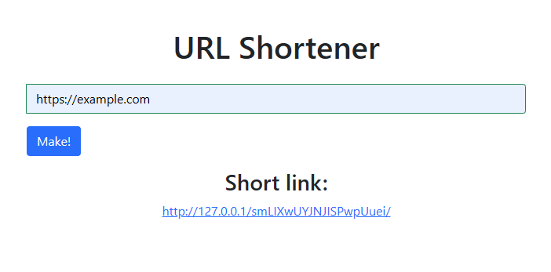

<p align="center">
    
</p>

<p align="center">
    
    
    
    
</p>

### Content:
* **[🔥 Features](#-features)**
* **[💡 Installation](#-installation)**

## 🔥 Features

### 🔷 Asynchronous app
 
App built with FastAPI.
It is a high performance framework In the process of writing the application, 
only asynchronous programming was used (except cpu-bound operation).
All i/o-bound operations are asynchronous.


### 📁 Database entry (postgres, redis)

App using a postgres database. All information about links is recorded in it. The Database contains one table

| id |       original       |             modified |
|:---|:--------------------:|---------------------:|
| 1  | https://google.com/  | mrknROpKuogikvRGDiHX |
| 2  | https://example.com/ | jYJKeSjnDcOvJwItGrZs |

The table is automatically created (if the table does not exist) every time when starting app.
It's possible because of 
`pg_table_builder` [module](https://github.com/byBenPuls/table-builder-pg).

After successful record in postgres database data save in a redis database. 
Data keep in key=value format in RAM machine.
It's really fast!

### 📱 Adaptive website

Website created with a Bootstrap framework. Bootstrap supports mobile screen size. 

### ⚡ Fast

The application checks whether the data is in the cache. 
For this reason, data is rapid and redirection occurs unnoticed.


### ️🛡️ Duplicate link protection

App has protection that compares original and modified links. It'd protect from infinite creating same links.

### ⚙️ API

The application allows you to send POST HTTP requests to receive a modified link.
**For example:**

Request:

```python
import requests

requests.post(
    '<Your address>/',
    json={"original_url": "https://google.com/"})
```
Response:
```python
{"endpoint": "https://<Your address>/mrknROpKuogikvRGDiHX/"}
```


## 💡 Installation

First, install a virtual environment `py -m venv venv`. 
Next, you need activating venv. Windows: `.\Scripts\activate` Linux: `source bin/activate`.
Most Python IDEs can on one's own create virtual environment. Also, you need to create env variable. 
You can use dotenv or your IDE. `DB_CONNECTION_STRING=postgres://...`

Then you need to install all requirements:
move to the root directory of the project and type `pip install -r requirements.txt`.

For launch FastAPI I'm using `uvicorn`.
You can choose parameters of launch (host, port) if it is necessary. 
After this, you can start a project, for example `py setup.py`.